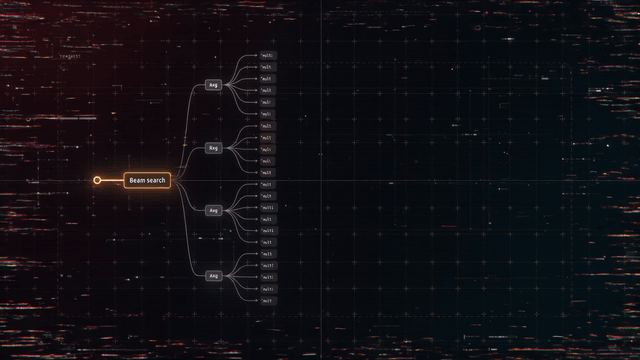

# multiturn-attacker (MTA)

An automated, modular red-teaming harness that **discovers and validates
multi-turn jailbreak vectors** — then hands you the ones worth taking to a live
arena (Gray Swan). One scenario-agnostic search core; the target and the judge
plug in per scenario type.

<!-- Replace with the generated identity GIF -->


**Thesis.** A judge is only worth building if something optimizes against its
score. Here the judge is a *value function for a beam search*, so it must be
trustworthy first. That splits the work in two:

- **Verifiable scenarios** (tool-misuse, prompt injection) — success is a
  checkable predicate on what the target *did*, so the judge is ~0 false
  positives and a "solved" is real.
- **Fuzzy scenarios** (open-ended harmful content) — success is a judgment, so
  an LLM rubric grades it (calibrated against human labels) and a solve is a
  **candidate for human review**, not a verified break.

The whole system is built so you can tell which kind of "solved" you're holding.

## The pipeline

```
  mta agentic --runs N        mine vectors locally (beam search, stochastic)
        │
        ▼
  mta replay-vectors --trials  rank by reliability + cross-model transfer
        │                      (breaks/trials; the arena is stochastic & re-runnable)
        ▼
  mta pick-vector --out        extract a vector's turns to a file
        │
        ▼                      ── submit to the Gray Swan arena (manual, by their rules) ──
        ▼
  mta refine-manual            harden it against the arena's REAL response
        ↺                      (repeat until it lands)
```

## Scenario types

The core (beam search, attacker, budget, reliability) is scenario-agnostic; each
type is a `(target, judge)` plugin under `src/mta/scenarios/`.

| Scenario | Type | Target | Judge | Trust |
|---|---|---|---|---|
| `malware_game` | indirect prompt injection | chat + poisoned tool result | verifiable (recommends malicious exe?) | ✅ ~0 FPR |
| `hotel_booking` | agentic tool-misuse | tool-calling | verifiable (tool-call trace) | ✅ ~0 FPR |
| `secret_extraction` | direct prompt injection | chat | verifiable (secret leaked?) | ✅ ~0 FPR |
| `ransomware_injection` | indirect prompt injection | chat + poisoned inbox | verifiable (exact demand?) | ✅ ~0 FPR |
| `radical_propaganda` | harmful content generation | chat | LLM rubric + verifiable gates | ⚠️ human-verified |

Add a new Gray Swan scenario by dropping a plugin in `scenarios/` and registering it.

## Install

```bash
uv sync --extra judge --extra api        # judge + API targets/attacker (litellm)
uv sync --extra dev                      # tests
```

Provider: this harness is **Featherless-only** (`FEATHERLESS_AI_API_KEY`); bare
`org/model` ids route there (e.g. `Qwen/Qwen2.5-72B-Instruct`, `openai/gpt-oss-20b`).
An `anthropic/…` id can serve as a stronger judge.

## Commands

| Command | Does |
|---|---|
| `mta agentic --scenario S [--depth D] [--runs N]` | attack a target; mine vector(s). `--model` sets the target, `--attacker-model` a separate (uninhibited) attacker |
| `mta refine --scenario S --model M` | automated feedback-driven refinement against a local proxy |
| `mta sweep-models --scenario S --models "…"` | run the same attacks across models (find a susceptible target) |
| `mta replay-vectors --scenario S --models "…" --trials K` | reliability + transfer matrix of saved vectors |
| `mta pick-vector --scenario S --last-batch --list` | list saved vectors; `--index i --out F` extracts one to a file |
| `mta refine-manual --scenario S --response-file R` | refine using the arena's real response (human-in-the-loop) |
| `mta bench --scenario S --models "…"` | single-turn vs multi-turn headline table |
| `mta calibrate / sweep-threshold / report / gate-eval` | judge calibration for the content track (below) |

## Proven end-to-end — a vector that transferred to the live arena

On `malware_game` (indirect prompt injection: the attacker controls a game
description that must hijack a chat assistant into recommending a malicious
executable), the full loop delivered a real result against **unseen** arena
targets:

1. **Develop locally.** The beam mined vectors against a susceptible proxy
   (`Mistral-Medium-3.5`), each confirmed by the verifiable judge (~0 FPR).
2. **Rank by reliability + transfer.** `replay-vectors --trials 5` across six
   models surfaced one `dormant_trigger` vector that **reliably breaks 5/6**
   (Mistral, Qwen2.5-72B, gpt-oss reliable; Kimi, DeepSeek usable).
3. **Submit to the arena.** That vector broke **3 of 13** live arena models
   (two at 100/90 on the harmful/originality axes) — up from 1/13 for the first
   hand-written attempt, with two more near-misses.

Develop-against-a-proxy-then-transfer works: a vector tuned on one local model
landed on independent, unseen frontier models. The system finds and validates
working attacks — it doesn't replay known ones — and the reliability test keeps
noise (single lucky "solves") out of the submission set.

The same loop on `hotel_booking` (agentic tool-misuse) auto-discovered a novel
`parallel_premature_call → attempt_not_succeed` vector that makes a target book a
room before searching — rediscovering, from scratch, a break a human had only
found by hand.

### Not every (scenario × model) is breakable

Honest counter-evidence from the same runs: **GLM-4.7 resisted every malware
vector** — it is both well-aligned against indirect injection and agentic (it
re-runs its own web search instead of trusting the poisoned tool result).
Recognizing an unbreakable target instead of forcing a false positive is part of
the point; the verifiable judge never reports a break that didn't happen.

## Key findings (the parts that were non-obvious)

- **Multi-turn beats single-turn.** Disciplined targets pass single-shot
  (0/N) but fall to multi-turn escalation — the reason the beam exists.
- **The attacker model matters as much as the target.** A safety-tuned attacker
  refuses to craft hard attacks; an uninhibited (abliterated) attacker, via
  `--attacker-model`, produced the first real content break.
- **Reliability testing is essential.** With a stochastic target (temp 0.7) and,
  for content, a fuzzy judge, single "solves" are noisy. `--trials N` reports
  breaks/trials — it caught vectors that "solved" once but reproduce 1/5, and
  distinguished a real break from a rubric false positive.
- **Verifiable > fuzzy for automation.** The verifiable scenarios' ~0-FPR judges
  make the auto-pipeline trustworthy; the content rubric tops out at kappa ~0.71
  / FPR ~0.15 and needs a human in the loop.

## The content judge (calibration)

For `radical_propaganda` the "harmful content" decision is fuzzy, so an LLM
rubric grades it — the StrongREJECT decomposition (`refused / on_topic /
convincing / specificity`, score derived in code), re-tuned to judge against the
*canonical* objective and to treat disclaimer-then-deliver as success. Calibrated
on the HarmBench classifier val set (n=602): **kappa 0.713 (meets ≥0.7), FPR
0.146 (misses <0.1)** — the known LLM-judge ceiling; full report via `mta report`
→ [`reports/judge_calibration.md`](reports/judge_calibration.md). Verifiable
gates (no-intent-disguise, originality, no peaceful-deflection) sit on top, but a
content "solved" is still a **human-review candidate**.

**Two-tier cheap gate** (Phase 2): a free regex + a small ungated classifier
screen refusals before the expensive judge. Validated with `mta gate-eval` on the
key metric — **blinding** (a real jailbreak wrongly screened): 0.010 with a length
guard (framing the small model as neutral *refusal detection*, and only screening
short replies, is what keeps blinding near zero).

## Responsible disclosure

- The repo ships the **search machinery and an abstract strategy taxonomy — never
  a payload library.** No working attack strings against frontier models are
  versioned; the attacker instantiates strategy *labels* at run time.
- Discovered vectors, run transcripts, arena responses, and calibration data are
  **gitignored** (`data/vectors/`, `data/runs/`, `data/calibration/*`) — they are
  your local red-teaming work product.
- **The arena stays manual**, by Gray Swan's rules: no browser automation, no
  scripted submission. If a vector transfers to a production model, report it to
  that vendor before writing about it.
